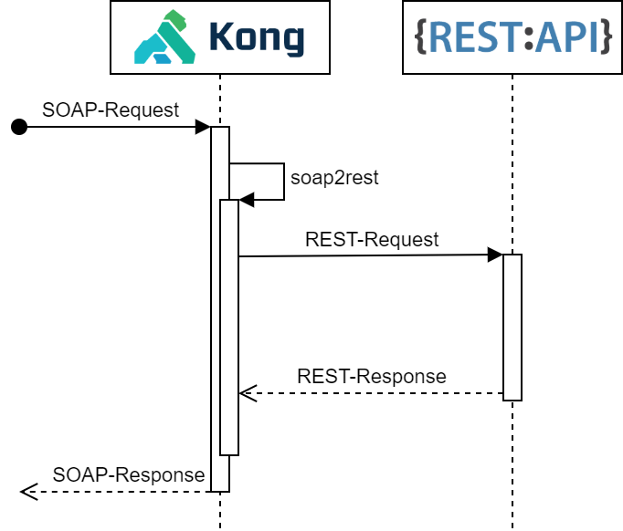

kong-plugin-soap2rest
=====================

A plugin for the [Kong Microservice API Gateway](https://konghq.com/solutions/gateway/) to redirect a SOAP request to a REST API and convert the JSON Response to SOAP response.



<!-- TABLE OF CONTENTS -->
<details open="open">
  <summary>Table of Contents</summary>
  <ol>
    <li><a href="#compatible-kong-versions">Compatible Kong versions</a></li>
    <li>
      <a href="#getting-started">Getting Started</a>
      <ul>
        <li><a href="#installation">Installation</a></li>
        <li><a href="#docker">Docker</a></li>
      </ul>
    </li>
    <li><a href="#usage">Usage</a>
      <ul>
        <li><a href="#configuration">Configuration</a></li>
        <li><a href="#enabling-plugin">Enabling plugin</a></li>
      </ul>
    </li>
    <li><a href="#development">Development</a>
      <ul>
        <li><a href="#preparing-the-development-environment">Preparing the development environment</a></li>
        <li><a href="#log-files">Log files</a></li>
        <li><a href="#testing">Testing</a></li>
      </ul>
    </li>
    <li><a href="#example">Example</a></li>
    <li><a href="https://github.com/adessoAG/kong-plugin-soap2rest/blob/master/LICENSE">License</a></li>
  </ol>
</details>

## Compatible Kong versions

| Kong Version |   Tests passing    |
| :----------- | :----------------: |
| 2.3.x        | :white_check_mark: |
| 2.2.x        | :white_check_mark: |
| 2.1.x        | :white_check_mark: |
| 2.0.x        | :white_check_mark: |

## Getting Started

### Installation

```bash
make install
```

### Docker
``` docker
FROM kong:2.3.0 as builder

USER root

RUN apk add --no-cache git zip && \
    git config --global url.https://github.com/.insteadOf git://github.com/

# Build kong-plugin-soap2rest
COPY . /plugins/soap2rest

WORKDIR /plugins/soap2rest

ENV LUAROCKS_SOAP2REST=kong-plugin-soap2rest
ENV LUAROCKS_SOAP2REST_VERSION=1.0.2-1

RUN luarocks make && \
    luarocks pack ${LUAROCKS_SOAP2REST} ${LUAROCKS_SOAP2REST_VERSION}

FROM kong:2.3.0

# Enable plugins
ENV KONG_PLUGINS="bundled,soap2rest"
ENV JWT_KEYCLOAK_PRIORITY="900"

COPY --from=builder /plugins/soap2rest/kong-plugin-soap2rest*.rock /tmp/plugins/

USER root

# Install plugins
RUN luarocks install /tmp/plugins/kong-plugin-soap2rest*.rock && \
    rm /tmp/plugins/*
```

## Usage

### Configuration

| Parameter                   | Required | Default | Description                                                              |
| :-------------------------- | :------: | :-----: | :----------------------------------------------------------------------- |
| name                        | yes      |         | The name of the plugin to use, in this case `soap2rest`.                 |
| service_id                  | semi     |         | The id of the Service which this plugin will target.                     |
| route_id                    | semi     |         | The id of the Route which this plugin will target.                       |
| enabled                     | no       | `true`  | Whether this plugin will be applied.                                     |
| config.rest_base_path       | yes      |         | The base path of the rest api. (Must start and end with '/')             |
| config.openapi_yaml_path    | yes      |         | The path of the OpenAPI file.                                            |
| config.wsdl_path            | yes      |         | The path of the WSDL file.                                               |
| config.operation_mapping    | no       |         | Map of operation id and rest path. (rest path must never begin with '/') |

### Enabling plugin

Set enabled kong enabled plugins, i.e. with environmental variable: `KONG_PLUGINS="bundled,soap2rest"`
You can enable it on service, routes and globally.

#### Service

<details open="open">
    <summary><b>Kong Admin API</b></summary>

```bash
curl -X POST http://localhost:8001/services/{service}/plugins \
    --data "name=soap2rest" \
    --data "config.rest_base_path=<rest base path>" \
    --data "config.openapi_yaml_path=<openapi yaml path>" \
    --data "config.wsdl_path=<wsdl path>" \
    --data "config.operation_mapping.<operation id>=<operation path>"
```

</details>

<details>
    <summary><b>Declarative (YAML)</b></summary>

```yml
plugins:
- name: soap2rest
  service: <service>
  config:
    rest_base_path: <rest base path>
    openapi_yaml_path: <openapi yaml path>
    wsdl_path: <wsdl path>
    operation_mapping:
      <operation id>: <operation path>
```

</details>

#### Route

<details open="open">
    <summary><b>Kong Admin API</b></summary>

```bash
curl -X POST http://localhost:8001/routes/{route_id}/plugins \
    --data "name=soap2rest" \
    --data "config.rest_base_path=<rest base path>" \
    --data "config.openapi_yaml_path=<openapi yaml path>" \
    --data "config.wsdl_path=<wsdl path>" \
    --data "config.operation_mapping.<operation id>=<operation path>"
```

</details>

<details>
    <summary><b>Declarative (YAML)</b></summary>

```yml
plugins:
- name: soap2rest
  route: <route>
  config:
    rest_base_path: <rest base path>
    openapi_yaml_path: <openapi yaml path>
    wsdl_path: <wsdl path>
    operation_mapping:
      <operation id>: <operation path>
```

</details>

#### Globally

<details open="open">
    <summary><b>Kong Admin API</b></summary>

```bash
curl -X POST http://localhost:8001/plugins \
    --data "name=soap2rest" \
    --data "config.rest_base_path=<rest base path>" \
    --data "config.openapi_yaml_path=<openapi yaml path>" \
    --data "config.wsdl_path=<wsdl path>" \
    --data "config.operation_mapping.<operation id>=<operation path>"
```

</details>

<details>
    <summary><b>Declarative (YAML)</b></summary>

```yml
plugins:
- name: soap2rest
  config:
    rest_base_path: <rest base path>
    openapi_yaml_path: <openapi yaml path>
    wsdl_path: <wsdl path>
    operation_mapping:
      <operation id>: <operation path>
```

</details>

## Development

### Preparing the development environment

Once you have Vagrant installed, follow these steps to set up a development
environment for both Kong itself as well as for custom plugins. It will
install the development dependencies like the `busted` test framework.

```shell
# clone this repository
$ git clone https://github.com/Kong/kong-vagrant
$ cd kong-vagrant

# clone the Kong repo (inside the vagrant one)
$ git clone https://github.com/Kong/kong

# only if you want to develop a custom plugin, also clone the plugin template
$ git clone https://github.com/adessoAG/kong-plugin-soap2rest.git kong-plugin

# build a box with a folder synced to your local Kong and plugin sources
$ vagrant up

# ssh into the Vagrant machine, and setup the dev environment
$ vagrant ssh
$ cd /kong
$ make dev

# Install dependencies
$ cd /kong-plugin
$ make setup

# only if you want to run the custom plugin, tell Kong to load it
$ export KONG_PLUGINS=bundled,soap2rest

# startup kong: while inside '/kong' call `kong` from the repo as `bin/kong`!
# we will also need to ensure that migrations are up to date
$ cd /kong/bin
$ kong migrations bootstrap
$ kong start
```

This will tell Vagrant to mount your local Kong repository under the guest's
`/kong` folder, and (if you cloned it) the 'kong-plugin' repository under the
guest's `/kong-plugin` folder.

To verify Kong has loaded the plugin successfully, execute the following
command from the host machine:

```shell
$ curl http://localhost:8001
```
In the response you get, the plugins list should now contain an entry
"soap2rest" to indicate the plugin was loaded.

### Log files

```shell
vagrant ssh -c "tail -F /kong/servroot/logs/error.log"
```

### Testing

```bash
make test
```

Running the tests and calculating the test coverage.
```bash
make coverage
```

## Example

### REST-API

#### Request
``` bash
curl -i -X GET --url http://localhost:8000/v2/pet/1
```

#### Response
```json
{
  "id": 1,
  "name": "doggie",
  "photoUrls": [],
  "tags": [],
  "status": "available"
}
```

### SOAP-API

#### Request
``` bash
curl -i -X POST --url http://localhost:8000/soap-api/v2/ \
    --header "Content-Type: application/xml" \
    --data '<?xml version="1.0" encoding="utf-8"?>
            <soap:Envelope
                xmlns:soap="http://schemas.xmlsoap.org/soap/envelope/"
                xmlns:tns="http://www.w3.org/2001/XMLSchema">
                <soap:Body>
                    <tns:GetPetByPetid_InputMessage>
                        <tns:petId>1</tns:petId>
                    </tns:GetPetByPetid_InputMessage>
                </soap:Body>
            </soap:Envelope>'
```

#### Response
```xml
<?xml version="1.0" encoding="UTF-8"?>
<soap:Envelope
  xmlns:soap="http://schemas.xmlsoap.org/soap/envelope/"
  xmlns:tns="http://www.w3.org/2001/XMLSchema">
  <soap:Body>
    <tns:GetPetByPetid_OutputMessage>
        <tns:Pet>
            <tns:id>1</tns:id>
            <tns:name>doggie</tns:name>
            <tns:photoUrls></tns:photoUrls>
            <tns:tags></tns:tags>
            <tns:status>available</tns:status>
        </tns:Pet>
    </tns:GetPetByPetid_OutputMessage>
  </soap:Body>
</soap:Envelope>
```
